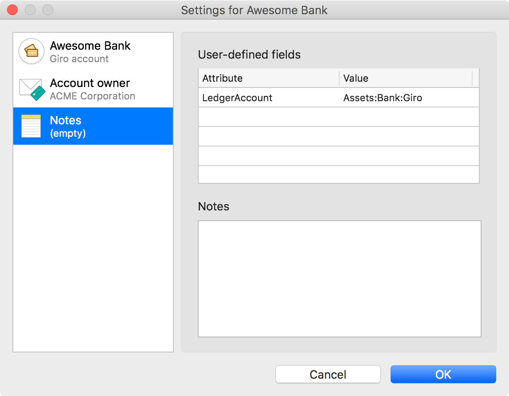

# Ledger extension for MoneyMoney

This extension for [MoneyMoney](https://moneymoney-app.com/) exports transactions in the [ledger](https://www.ledger-cli.org)/[hledger](https://hledger.org) format for text-based double-entry accounting.

## Export format

The extension creates a text file in ledger `.journal` format. The used syntax is fully compatible with both ledger and hledger:

```ledger
; Export: 2042-04-02 10:04:00
decimal-mark ,

2042-04-02=2042-04-01 * (2042-0042.pdf) Some Client
  ; purpose: Invoice no. 2042-0042
  ; comment: A nice comment
  ; customtag:
  Income:Revenue  -1.190,00 € ; [=2042-03-20]
    ; tax: 19%
  Assets:Bank
```

## How to use

### Installation

1. Download the <a href="https://raw.githubusercontent.com/lukasbestle/moneymoney-ledger/main/Ledger.lua" download>extension file</a> from the repository.
2. Open the database directory of MoneyMoney as described on the [MoneyMoney website](https://moneymoney-app.com/extensions/).
3. Place the extension file (`Ledger.lua`) in the `Extensions` directory of your MoneyMoney database.

### Export process

To export your MoneyMoney transactions to the ledger format, select one or more transactions, right-click and select "Export Transactions..." (or use the same option in the "Account" menu). In the format selector, choose "Ledger (.journal)".

By default, the extension validates that each transaction in MoneyMoney was assigned to a category and has the checkmark (menu "View > Checkmarks") checked. The selected category will be used as the counter account in the double-entry transaction. The checkmark allows you to confirm every transaction inside MoneyMoney before you export it to your accounting setup.

If you don't need these safety checks, you can disable them with the checkboxes in the export dialog:

- If you disable the category check, transactions without an assigned category will be booked to an account named `Unknown`.
- If you disable the checkmark check, transactions without the checkmark are exported with an empty status character (or a `!` sign if the transaction is pending).

Transactions that cause an export error because of the safety checks or because of invalid customization options are printed in commented-out form.

## Input format and customization

The ledger format is very rich. While MoneyMoney has good metadata support, some accounting metadata cannot be recorded natively. However you can use the following, fully optional text syntax in category names and transaction comments. This syntax will then be automatically converted on export.

### Financial account

The **name of the financial account** in ledger will be generated from the name of your bank account in MoneyMoney by default. So if your bank account is called "Giro", the generated ledger account name will be "Assets:Giro".

You can optionally customize the ledger account name with a user-defined field in MoneyMoney. To do this, right-click on your account in the MoneyMoney sidebar, open the account settings and switch to the "Notes" page. There you will find a table for user-defined fields. Create a new user-defined field with the attribute name `LedgerAccount` and set it to your custom account name:



The custom account name does *not* have to start with "Assets:".

### Category

The counter account of each transaction is determined by the selected MoneyMoney category.

The **name of the counter account** in ledger will be generated from the MoneyMoney category hierarchy. So a category `Expenses > Travel > Accommodation` (with `>` representing the hierarchy) becomes the account `Expenses:Travel:Accommodation`. If you need to customize the account name, you can use square brackets in the name of your categories or category groups:

- Adding empty square brackets `[]` into the name makes that nesting level disappear. This can be used to:
  - organize your categories inside MoneyMoney (e.g. `My Business [] > Expenses > Travel` becomes just `Expenses:Travel`) or to
  - create catch-all categories that will use the category group as an account name (e.g. `Expenses > Travel > Etc. []` becomes just `Expenses:Travel`).
- Adding non-empty square brackets overrides the name of the current and all higher hierarchy levels. Examples:
  - `My Business > Travel [Expenses:Travel] > Accommodation` becomes `Expenses:Travel:Accommodation`.
  - `Travel > Accommodation [1234]` becomes `1234` (useful if your ledger accounts are aliased).

Each category can additionally have two different types of tags:

- You can define a **tax tag** with the `{tax}` syntax. E.g. `{19%}` becomes the output `CounterAccount  123.00 € ; tax: 19%`. The tax tag is always set directly on the posting of the counter account, not on the whole transaction (because the tax does not apply to the financial account).
- You can define one or multiple **custom tags** with the `#tag` or `#tag:value` syntax. The name and value may contain every character except whitespace and the comma (which is used to separate tags in hledger). The name may not contain the colon (which is the value separator in both ledger and hledger). Custom tags are set on the whole transaction.

All tags can be defined on any category hierarchy level (on a category group or on the category directly). Values defined higher up are inherited but overridden by values defined below.

### Transaction

Each individual MoneyMoney transaction provides a lot of native metadata. The goal of this extension is to export all information that can be useful for accounting:

The **transaction dates** (booking date and value date) are used as the two dates in the ledger transaction. If you specifically want to override the date of the counter posting, you can use the `[date1=date2]` syntax in the "Comment" field of the MoneyMoney transaction (right-click, "Add Comment..."). Both dates are optional, so you can use `[date1]` to just override the booking date and `[=date2]` to just override the value date. Overriding the dates can be useful e.g. to record invoice dates.

The **transaction status** is stored in the character after the dates in the first line of the ledger transaction. Possible values are `*` for a cleared transaction (checkmark in MoneyMoney is checked), `!` for a pending transaction (displayed with striped background in MoneyMoney) and no character for an unmarked transaction (neither pending nor cleared).

The **recipient name** is used as the payee in the first line of the transaction.

If the "Comment" field of the MoneyMoney transaction (right-click, "Add Comment...") contains the `<code>` syntax, its value is stored as the transaction code in parentheses. This can be used to store the **file name of the associated receipt or invoice**. The value in between the angle brackets can be whatever you require.

**All other tags** (`{tax}` tags and `#custom` tags) from the category name or the "Comment" field of the transaction are stored as tags. If a tag is set both in the category and in the transaction, the definition in the transaction has precedence, otherwise the definition from the category is inherited. You can read more about the tag syntax in the [category section](#category).

If the "Comment" field of the MoneyMoney transaction contains additional text that is not detected as special syntax (`[dates]`, `<code>`, `{tax}` or `#custom` tags), the **comment** will be stored as a `; comment: ...` tag. If the comment contains multiple lines, the lines are concatenated with a single space.

The **purpose text** of the transaction is stored as a `; purpose: ...` tag. If the purpose contains multiple lines, the lines are concatenated with a single space.

The **account names** are generated based on the [bank account](#bank-account) and [category](#category) settings.

The **amount** is taken from the MoneyMoney transaction and formatted according to the system locale. Please note that the sign of the amount is intentionally flipped because the amount you see is the amount of the *counter posting* (the mirror value of the financial posting). The amount of the financial posting is left blank because ledger/hledger automatically balance the transaction.

## Credits

The text syntax for category names and transaction comments and the export options were inspired by the [MoneyMonkey](https://github.com/timpritlove/moneymonkey) extension by Tim Pritlove.
